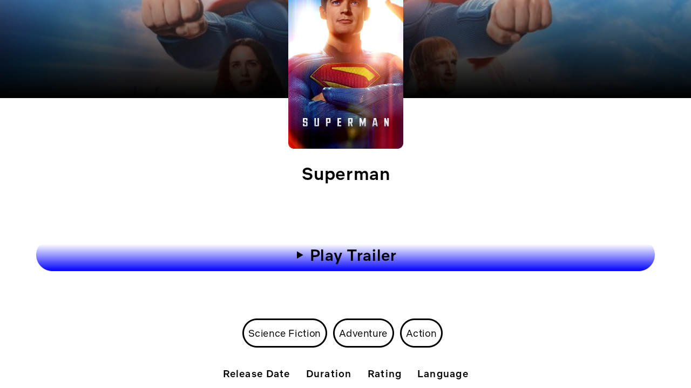
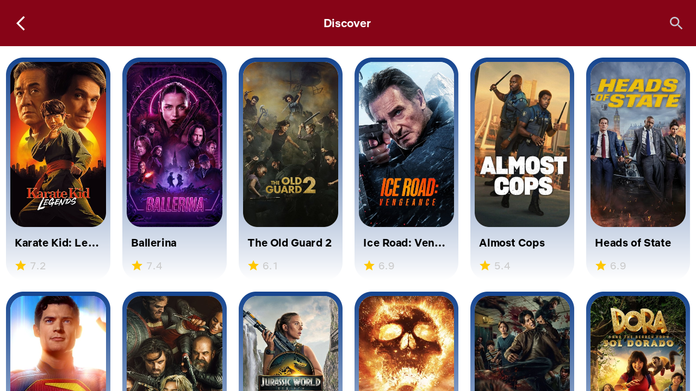

# 🎬 Movies TV Compose Android App

A modern Android application that displays a collection of movies fetched from The Movie Database (TMDB) API. Users can browse movies, view detailed movie information, watch trailers using ExoPlayer, and manage a personal watchlist — all built with the latest Android technologies.

---

## 🛠️ Built With

- **Jetpack Compose** – Modern UI toolkit
- **MVVM Architecture** – Clean, testable separation of concerns
- **Dagger Hilt** – Dependency Injection
- **Retrofit** – Networking (REST API)
- **Room Database** – Local storage (Watchlist)
- **Paging 3** – Efficient data pagination
- **ExoPlayer** – Trailer playback
- **Coil** – Image loading
- **Navigation Compose** – Seamless in-app navigation

---

## 📸 Features

- 🎞️ **Home Screen**: Latest movies, genres, and featured banners
- 🔍 **Search**: Find movies by title
- 🎬 **Movie Detail Screen**:
    - Movie title, overview, release date, rating
    - ✅ Cast information with profile photos
    - ✅ Similar movies suggestions
    - ▶️ Watch official trailers with **ExoPlayer**
- ❤️ **Watchlist**: Add or remove movies using Room Database
- ⚡ Efficient infinite scrolling using Paging 3
- 🎨 Modern Jetpack Compose UI with responsive design

---

## 📷 Screenshots

| Home Screen | Detail with Cast                 | Trailer Player | Watchlist |
|-------------|----------------------------------|---------------|----------------|-----------|
|  |  |  |  |

---

## 🧩 Architecture Overview

+-- data
| +-- remote (DTOs, Retrofit API interface)
| +-- local (Room entities, DAO)
| +-- repository (Data source coordination)
|
+-- viewmodel (All ViewModels and StateFlows)
+-- screens (Compose UIs for Home, Detail, Search, Watchlist)
+-- utils (Constants, sealed classes for UI state, helpers)

---

▶️ How to Run
Clone the project:

git clone https://github.com/yourusername/moviesdb-compose.git
cd moviesdb-compose
Open in Android Studio (Giraffe or later)

Build and run on emulator or real device

📚 Libraries Used
Library	Purpose
Jetpack Compose	Declarative UI
Navigation	Navigation between screens
Hilt	Dependency Injection
Retrofit	HTTP Networking
Room	Local DB for Watchlist
Paging 3	Infinite Scroll Support
ExoPlayer	Trailer Playback (HLS/MP4)
Coil	Image Loading

📈 Upcoming Features
User authentication with Firebase

Local caching with Room + Paging RemoteMediator

Ratings, reviews, and comments

Android TV & Tablet support

Unit & UI Testing with Compose Testing APIs

📄 License
This project is licensed under the MIT License - see the LICENSE file for details.

🙋‍♂️ Author
Akshay Sakare – @akshaysakare

